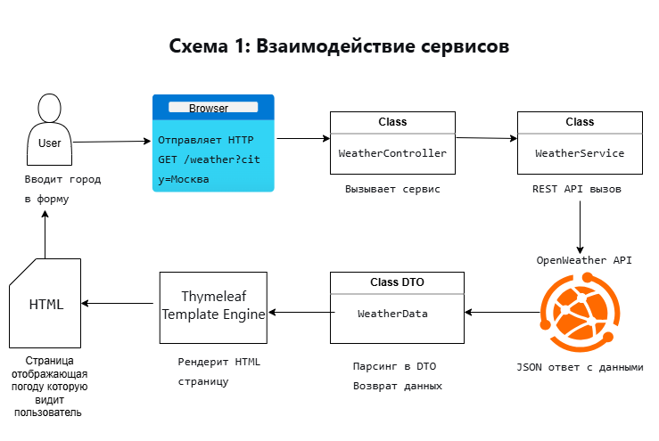

## Weather App
Spring Boot приложение для получения данных о погоде через OpenWeather API.
## Технологии

- Java 21
- Spring Boot 3.5.7
- Thymeleaf
- Maven
- OpenWeather API

## Архитектура
### Схема взаимодействия сервисов


- Приложение построено по MVC паттерну:
- Controller - обработка HTTP запросов
- Service - бизнес-логика
- Model - данные и DTO
- REST Client - взаимодействие с OpenWeather API

## Функциональность
✅ Поиск погоды по названию города
✅ Валидация ввода
✅ Обработка ошибок (город не найден)
✅ Веб-интерфейс

## Установка
1. Клонируйте репозиторий       
2. Создайте `application-local.properties`:
   ```properties
   weather.api.key=ваш_api_ключ
   ``` 
3. Запустите: `mvn spring-boot:run`
4. Откройте: `http://localhost:8080`


##  Development
```bash
# Сборка и тесты
mvn clean compile

# Запуск приложения
mvn spring-boot:run

# Только тесты
mvn test

# Сборка JAR
mvn clean package
```

## Структура проекта
```
src/
├── main/
│   ├── java/com/weather/app/
│   │   ├── controller/     # Web endpoints
│   │   ├── service/        # Business logic  
│   │   ├── model/          # Data classes
│   │   └── config/         # Configuration
│   └── resources/
│       ├── templates/      # Thymeleaf pages
│       └── application.properties
```

Разработано с ❤️ для изучения Spring Boot
P.S. Илон, если читаешь - я готов к Tesla! 🚗


License

MIT License

Copyright (c) 2025 Weather App

Permission is hereby granted, free of charge, to any person obtaining a copy
of this software and associated documentation files (the "Software"), to deal
in the Software without restriction, including without limitation the rights
to use, copy, modify, merge, publish, distribute, sublicense, and/or sell
copies of the Software, and to permit persons to whom the Software is
furnished to do so, subject to the following conditions:

The above copyright notice and this permission notice shall be included in all
copies or substantial portions of the Software.

THE SOFTWARE IS PROVIDED "AS IS", WITHOUT WARRANTY OF ANY KIND, EXPRESS OR
IMPLIED, INCLUDING BUT NOT LIMITED TO THE WARRANTIES OF MERCHANTABILITY,
FITNESS FOR A PARTICULAR PURPOSE AND NONINFRINGEMENT. IN NO EVENT SHALL THE
AUTHORS OR COPYRIGHT HOLDERS BE LIABLE FOR ANY CLAIM, DAMAGES OR OTHER
LIABILITY, WHETHER IN AN ACTION OF CONTRACT, TORT OR OTHERWISE, ARISING FROM,
OUT OF OR IN CONNECTION WITH THE SOFTWARE OR THE USE OR OTHER DEALINGS IN THE
SOFTWARE.
